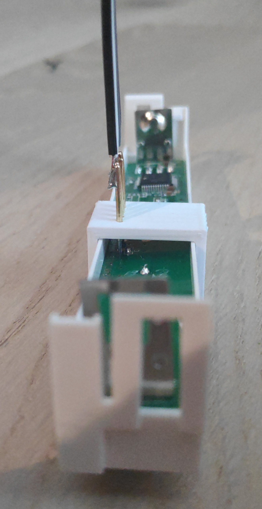

# Medion HM-SEC-SC

This is a firmware for Medion MAX! door/window contacts as sold by Aldi/Hofer.
These window contacts contain an STM8L and an Si4430 radio module instead of 
the Samsung processor used in the original MAX! door/window contact series.

The firmware is heavily based on work by Timo Schlüßler who did all the hard
work in getting AskSin on the STM8L/Si4430 combination. His work can be found
at https://github.com/timo-schluessler/custom-hm-cc-rt-dn

## Compilation

You need a Linux machine with sdcc, stm8flash, stm8-binutils-gdb and srecord as
well as CMake for configuring the build system.

The desired Serial and ID are configured in the EEPROM of the device. The EEPROM
can be written separately, see flash.sh/flash.sh.in for instructions.

When flashing, stm8flash has a bug that prevents it from writing to the STM8L052C6
device. See Issue 139 at https://github.com/vdudouyt/stm8flash/issues/139 for
details and resolution.

## Hardware and pinout

Remove the cover and the battery compartment of the door/window contact. You should
see 4 pads in a row, whereas 2 are very small and 2 are larger. They are labelled
MP6 and MP7. This is where the programming adapter needs to be connected to.

Left of MP7 (with the text being readable) is GND, MP7 is RESET, beetween MP6
and MP7 is 3.3V and MP6 is SWIM. If you disassemble your device further, the pins
are marked PRG1 on the other side of the PCB.

If you use the Pogo-Pin programming adapter, it should easily snap in place and
you should be able to adjust the height of the pogo pins so that they align properly.

Pinout:

  - Black: GND
  - White: RESET
  - Grey: 3V3
  - Purple: SWIM

## Installation

  - Open flash.sh.in in an editor and configure device address and serial number:
  `echo -ne "\x00\x85\x19MME0008519" | srec_cat - -binary -offset 0x1000 -o "@CMAKE_CURRENT_BINARY_DIR@"/id.ihx -intel`
  The first 3 bytes \x00 \x85 \x19 are the address, MME0008519 the serial number.
  change it to unique IDs within your Homematic environment
  - When flashing the first time, the STM8L needs to be unlocked. Connect the flash
  adapter and run `stm8flash -p stm8l052c6 -c stlinkv2 -u`. This erases the MAX! firmware
  and is the point of no return.
  - Compile the code (even if you've already done so!)
  - Run flash.sh from you build folder to program the STM8L
  - Pair as usual to your Homematic central

## Status

Currently, the basics are working. A short button press initializes pairing
or, if already paired, enables config mode. Reading the magnet and sending
the status is working - if it's sent successfully, it blinks once, in case
of error, it blinks three times. 
Changing the AES key and AES challenge-response is also working.

## Battery consumption

During idle, the battery consumption is about 22uA. The consumption rises significantly
during transmit and receive, up to a few mA.

## TODO

  - Peering

## Caveats

This has only been tested with Homegear, not with FHEM or a CCU!
After unlocking the flash, there is no way back to the MAX! firmware.
